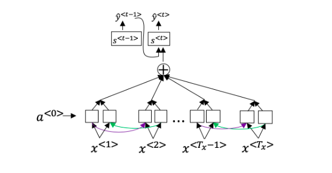

## Sequence models & Attention mechanism

1. Consider using this encoder-decoder model for machine translation.
  

  This model is a "conditional language model" in the sense that the encoder portion (shown in green) is modeling the probability of the input sentence $x$.
    - [x] True
    - [ ] False
---
2. In beam search, if you increase the beam width BB, which of the following would you expect to be true? Check all that apply.
    - [x] Beam search will run more slowly.
    - [x] Beam search will use up more memory.
    - [x] Beam search will generally find better solutions (i.e. do a better job maximizing P(y \mid x)P(y∣x))
    - [ ] Beam search will converge after fewer steps.
----
3. In machine translation, if we carry out beam search without using sentence normalization, the algorithm will tend to output overly short translations.
    - [x] True
    - [ ] False
---
4. Suppose you are building a speech recognition system, which uses an RNN model to map from audio clip $x$ to a text transcript $y$. Your algorithm uses beam search to try to find the value of $y$ that maximizes $P(y \mid x)$.
  On a dev set example, given an input audio clip, your algorithm outputs the transcript $\hat{y} =$ "I’m building an A Eye system in Silly con Valley.", whereas a human gives a much superior transcript $y^* =$ "I’m building an AI system in Silicon Valley.".
  According to your model,
  $P(\hat{y} \mid x) = 1.09*10^{-7}$
  $P(y^∗ \mid x) = 7.21∗10^{−8}$
  Would you expect increasing the beam width B to help correct this example?

    - [x] No, because $P(y^∗ \mid x) \leq P(\hat{y} \mid x)$ indicates the error should be attributed to the RNN rather than to the search algorithm.
    - [ ] No, because $P(y^∗ \mid x) \leq P(\hat{y} \mid x)$ indicates the error should be attributed to the search algorithm rather than to the RNN.
    - [ ] Yes, because $P(y^∗ \mid x) \leq P(\hat{y} \mid x)$ indicates the error should be attributed to the RNN rather than to the search algorithm.
    - [ ] Yes, because $P(y^∗ \mid x) \leq P(\hat{y} \mid x)$ indicates the error should be attributed to the search algorithm rather than to the RNN.
---
5. Continuing the example from Q4, suppose you work on your algorithm for a few more weeks, and now find that for the vast majority of examples on which your algorithm makes a mistake, $P(y^∗ \mid x) > P(\hat{y} \mid x)$. This suggest you should focus your attention on improving the search algorithm.
    - [x] True
    - [ ] False
---
6. Consider the attention model for machine translation.
  

  Further, here is the formula for $\alpha^{<t,t′>}$.

  

  Which of the following statements about $\alpha^{<t,t′>}$ are true? Check all that apply.

    - [x] We expect $\alpha^{<t,t'>}$ to be generally larger for values of $a^{<t'>}$ that are highly relevant to the value the network should output for $y^{<t>}$. (Note the indices in the superscripts.)
    - [ ] We expect $\alpha^{<t,t'>}$ to be generally larger for values of $a^{<t>}$ that are highly relevant to the value the network should output for $y^{<t'>}$. (Note the indices in the superscripts.)
    - [ ] $\sum_{t} \alpha^{<t,t'>}=1$ (Note the summation is over $t$.)
    - [ ] $\sum_{t'} \alpha^{<t,t'>}=1$ (Note the summation is over $t'$.)

7. The network learns where to “pay attention” by learning the values e<t,t′>, which are computed using a small neural network:
  We can't replace $s^{<t-1>}$ with $s^{<t>}$ as an input to this neural network. This is because $s^{<t>}$ depends on $\alpha^{<t,t′>}$ which in turn depends on $e^{<t,t′>}$; so at the time we need to evalute this network, we haven’t computed $s^{<t>}$ yet.

    - [x] True
    - [ ] False
---
8. Compared to the encoder-decoder model shown in Question 1 of this quiz (which does not use an attention mechanism), we expect the attention model to have the greatest advantage when:
    - [x] The input sequence length $T_x$ is large.
    - [ ] The input sequence length $T_x$ is small.
---
9. Under the CTC model, identical repeated characters not separated by the "blank" character (_) are collapsed. Under the CTC model, what does the following string collapse to? __c_oo_o_kk___b_ooooo__oo__kkk
    - [ ] cokbok
    - [x] cookbook
    - [ ] cook book 
    - [ ] coookkboooooookkk
---
10. In trigger word detection, $x^{<t>}$ is:
    - [x] Features of the audio (such as spectrogram features) at time $t$.
    - [ ] The $t$-th input word, represented as either a one-hot vector or a word embedding.
    - [ ] Whether the trigger word is being said at time $t$.
    - [ ] Whether someone has just finished saying the trigger word at time $t$.
---
